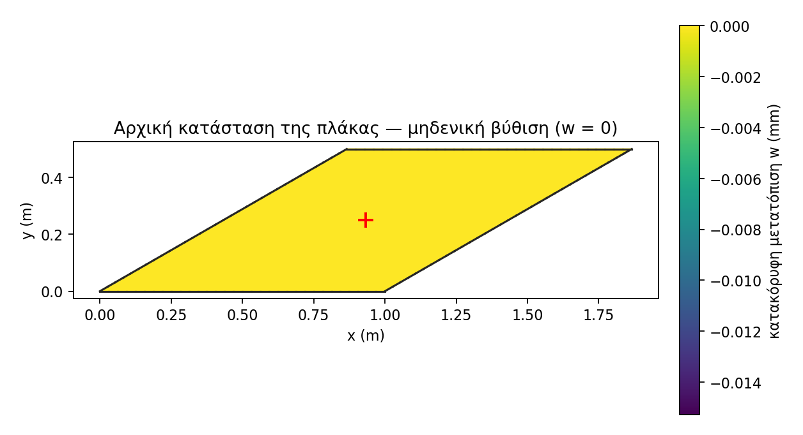
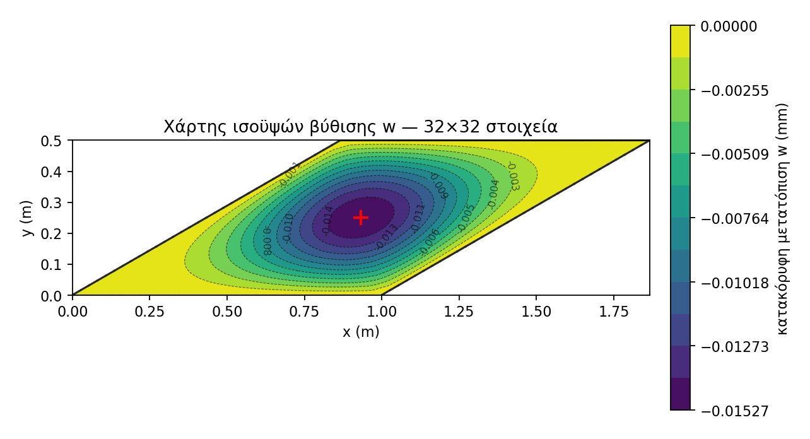

# Στατική Ανάλυση Λεπτής Πλάκας Kirchhoff με Πεπερασμένα Στοιχεία

Επίλυση του στατικού προβλήματος κάμψης **λεπτής ρομβοειδούς (λοξής) πλάκας** με τη
Μέθοδο Πεπερασμένων Στοιχείων (FEM), βάσει της θεωρίας πλακών **Kirchhoff–Love**.
Το αποθετήριο υλοποιεί ένα μη-συμβατό τετρακομβικό στοιχείο κάμψης 12 βαθμών
ελευθερίας (τύπου **ACM**, πολυωνυμική βάση), πραγματοποιεί **έλεγχο σύγκλισης** της
μέγιστης μετατόπισης και υπολογίζει την **τάση στο κέντρο** της πλάκας, την οποία
συγκρίνει με την τιμή αναφοράς του benchmark **NAFEMS**.

> Υπολογιστικό Θέμα 2 – Υπολογιστική Μηχανική ΙΙ.

---

## Πίνακας περιεχομένων
1. [Το πρόβλημα](#το-πρόβλημα)
2. [Θεωρητικό υπόβαθρο](#θεωρητικό-υπόβαθρο)
3. [Διατύπωση πεπερασμένων στοιχείων](#διατύπωση-πεπερασμένων-στοιχείων)
4. [Δομή αποθετηρίου](#δομή-αποθετηρίου)
5. [Εγκατάσταση](#εγκατάσταση)
6. [Χρήση](#χρήση)
7. [Αποτελέσματα & επαλήθευση](#αποτελέσματα--επαλήθευση)
8. [Οπτικοποίηση](#οπτικοποίηση)
9. [Αριθμητικές λεπτομέρειες](#αριθμητικές-λεπτομέρειες)
10. [Περιορισμοί & πιθανές επεκτάσεις](#περιορισμοί--πιθανές-επεκτάσεις)
11. [Αναφορές](#αναφορές)

---

## Το πρόβλημα

Θεωρούμε επίπεδη **ρομβοειδή πλάκα** πλευράς `L = 1.0 m` και οξείας γωνίας `30°`,
η οποία:

- **στηρίζεται με απλές αρθρώσεις** σε όλη την περίμετρό της (simply supported —
  μηδενική βύθιση `w = 0`, **ελεύθερες περιστροφές**),
- φορτίζεται με **ομοιόμορφα κατανεμημένη πίεση** `q = −0.7 kPa` στη διεύθυνση `z`.

| Μέγεθος | Σύμβολο | Τιμή |
|---|---|---|
| Πλευρά ρόμβου | `L` | `1.0 m` |
| Οξεία γωνία | `θ` | `30°` |
| Πάχος | `t` | `0.01 m` |
| Μέτρο ελαστικότητας | `E` | `210 × 10³ MPa = 210 GPa` |
| Λόγος Poisson | `ν` | `0.3` |
| Πίεση | `q` | `−0.7 kPa = −700 Pa` |

**Ζητούμενα**
1. Έλεγχος σύγκλισης της **μέγιστης μετατόπισης** για πλέγματα `4×4, 8×8, 16×16, 32×32`.
2. Υπολογισμός των **τάσεων στην κάτω επιφάνεια**, στο **σημείο τομής των διαγωνίων**
   (κέντρο), και της **μέγιστης κύριας τάσης** εκεί. Σύγκριση με την τιμή αναφοράς
   `σ* = 0.802 MPa` (NAFEMS).

Οι κορυφές του ρόμβου στο επίπεδο `xy` είναι:
`(0, 0)`, `(1, 0)`, `(1 + cos30°, sin30°)`, `(cos30°, sin30°)`.

---

## Θεωρητικό υπόβαθρο

### Θεωρία λεπτών πλακών Kirchhoff–Love

Για **λεπτή** πλάκα (πάχος πολύ μικρότερο των διαστάσεων στο επίπεδο) ισχύουν οι
παραδοχές Kirchhoff:

- ευθύγραμμα τμήματα κάθετα στο μέσο επίπεδο παραμένουν **ευθύγραμμα, αδιάτατα και
  κάθετα** στο παραμορφωμένο μέσο επίπεδο (αμελείται η διατμητική παραμόρφωση),
- η εγκάρσια ορθή τάση `σ_z` αμελείται.

Έτσι όλο το πεδίο μετατοπίσεων περιγράφεται από **μία** συνάρτηση, την εγκάρσια
βύθιση `w(x, y)`. Οι στροφές ορίζονται (σύμβαση του κώδικα) ως

$$\theta_x = -\frac{\partial w}{\partial y}, \qquad \theta_y = +\frac{\partial w}{\partial x}.$$

### Καμπυλότητες και ροπές

Το διάνυσμα **καμπυλοτήτων** (γενικευμένες παραμορφώσεις) είναι

$$\boldsymbol{\kappa} =
\begin{Bmatrix} \kappa_x \\ \kappa_y \\ \kappa_{xy} \end{Bmatrix} =
\begin{Bmatrix} \dfrac{\partial^2 w}{\partial x^2} \\[2mm]
\dfrac{\partial^2 w}{\partial y^2} \\[2mm]
2\,\dfrac{\partial^2 w}{\partial x\,\partial y} \end{Bmatrix}.$$

Ο καταστατικός νόμος συνδέει τις **ροπές ανά μονάδα μήκους** `M = [M_x, M_y, M_xy]ᵀ`
με τις καμπυλότητες μέσω του μητρώου καμπτικής δυσκαμψίας `D`:

$$\mathbf{M} = \mathbf{D}\,\boldsymbol{\kappa}, \qquad
\mathbf{D} = \frac{E\,t^3}{12\,(1-\nu^2)}
\begin{bmatrix} 1 & \nu & 0 \\ \nu & 1 & 0 \\ 0 & 0 & \tfrac{1-\nu}{2} \end{bmatrix}.$$

Ο συντελεστής `D₀ = E t³ / [12(1−ν²)]` είναι η **καμπτική ακαμψία** της πλάκας.

### Τάσεις ακραίας ίνας

Η κατανομή της ορθής τάσης λόγω κάμψης είναι γραμμική στο πάχος· η μέγιστη (ακραία
ίνα, `z = ±t/2`) προκύπτει από τις ροπές:

$$\boldsymbol{\sigma} = \frac{6}{t^2}\,\mathbf{M}.$$

Στην **κάτω επιφάνεια** και στο κέντρο, από τις `σ_x, σ_y, τ_xy` υπολογίζεται η
**μέγιστη κύρια τάση** (κύκλος Mohr):

$$\sigma_{1} = \frac{\sigma_x+\sigma_y}{2} +
\sqrt{\left(\frac{\sigma_x-\sigma_y}{2}\right)^2 + \tau_{xy}^2}.$$

---

## Διατύπωση πεπερασμένων στοιχείων

### Το στοιχείο (12 β.ε., τύπου ACM)

Τετρακομβικό τετράπλευρο στοιχείο με **3 βαθμούς ελευθερίας ανά κόμβο** —
`(w, θ_x, θ_y)` — δηλαδή `12` β.ε. ανά στοιχείο. Η βύθιση προσεγγίζεται με το
**ατελές κυβικό πολυώνυμο** 12 όρων:

$$
w(x,y) = a_1 + a_2 x + a_3 y + a_4 x^2 + a_5 xy + a_6 y^2 + a_7 x^3 + a_8 x^2 y + a_9 x y^2 + a_{10} y^3 + a_{11} x^3 y + a_{12} x y^3
$$

Αντικαθιστώντας τους 4 κόμβους (με `w`, `−w_{,y}`, `w_{,x}`) σχηματίζεται το μητρώο
`A` (12×12): `d = A a ⟹ a = A⁻¹ d`. Οι **συναρτήσεις σχήματος** και το μητρώο
**παραμόρφωσης–μετατόπισης** είναι

$$\mathbf{N} = \mathbf{P}\,\mathbf{A}^{-1}, \qquad
\mathbf{B} = \mathbf{L}\,\mathbf{A}^{-1}, \qquad \boldsymbol{\kappa} = \mathbf{B}\,\mathbf{d}.$$

Το στοιχείο είναι **μη-συμβατό (non-conforming)**: εξασφαλίζει συνέχεια του `w` αλλά
όχι της κάθετης κλίσης κατά μήκος των πλευρών.

### Μητρώο δυσκαμψίας και διάνυσμα φορτίου

$$\mathbf{k}_e = \int_{\Omega_e} \mathbf{B}^{\mathsf T}\,\mathbf{D}\,\mathbf{B}\;\mathrm{d}\Omega,
\qquad
\mathbf{f}_e = \int_{\Omega_e} \mathbf{N}^{\mathsf T}\,q \;\mathrm{d}\Omega
\quad(\text{συνεπές διάνυσμα φορτίου}).$$

Η ολοκλήρωση γίνεται αριθμητικά με **τετραγωνισμό Gauss 3×3**, με χρήση της
Ιακωβιανής της ισοπαραμετρικής απεικόνισης για το στοιχείο επιφάνειας `dΩ`.

### Συναρμολόγηση, οριακές συνθήκες, επίλυση

Τα `k_e`, `f_e` συναρμολογούνται στο καθολικό σύστημα `K U = F`. Επιβάλλονται οι
**απλές αρθρώσεις** (`w = 0` στην περίμετρο, μηδενισμός γραμμής/στήλης και μονάδα
στη διαγώνιο) και το σύστημα επιλύεται ως προς `U`.

### Ανάκτηση τάσεων

Οι τάσεις είναι **δεύτερες παράγωγοι** του `w`, οπότε συγκλίνουν πιο αργά από τις
μετατοπίσεις. Στο **σημείο τομής των διαγωνίων** γίνεται **μέσος όρος (nodal
averaging)** των τάσεων των γειτονικών στοιχείων, ακριβώς στο κεντρικό σημείο.

---

## Δομή αποθετηρίου

```
.
├── pre_processor.py     # Γεννήτρια πλέγματος ρόμβου, Mesh, Material (D), BoundaryConditions
├── solver.py            # KirchhoffPlateElement (A, B, N, ke, fe), Assembler, Solver
├── post_processor.py    # PostProcessor: μετατοπίσεις, τάσεις, μέγ. κύρια τάση στο κέντρο
├── main.py              # Driver: μελέτη σύγκλισης + σύγκριση με NAFEMS
├── visualizer.py        # Οπτικοποίηση: 2D αρχική κατάσταση (w=0) + 2D contour βύθισης -> PNG
├── report.tex           # Πλήρης αναφορά (LaTeX, XeLaTeX)
└── README.md
```

| Αρχείο | Ρόλος |
|---|---|
| `pre_processor.py` | **Pre-processing**: δομημένο πλέγμα ρόμβου, ιδιότητες υλικού (μητρώο `D`), οριακές συνθήκες. |
| `solver.py` | **Πυρήνας FEM**: πολυωνυμική βάση, `A`/`B`/`N`, μητρώο δυσκαμψίας & φορτίου (Gauss 3×3), συναρμολόγηση, επίλυση. |
| `post_processor.py` | **Post-processing**: εξαγωγή μετατοπίσεων, τάσεις σε σημείο/στοιχείο, μέγιστη κύρια τάση στην τομή των διαγωνίων. |
| `main.py` | Εκτελεί τη μελέτη σύγκλισης και τυπώνει τον πίνακα αποτελεσμάτων. |
| `visualizer.py` | Παράγει δύο 2D κάτοψεις PNG: αρχική κατάσταση (w=0) και χάρτη ισοϋψών της βύθισης. |
| `report.tex` | Πλήρης επιστημονική αναφορά σε LaTeX (μεταγλώττιση με XeLaTeX). |

---

## Εγκατάσταση

Απαιτείται **Python 3.9+** με:

```bash
pip install numpy matplotlib
```

- `numpy` — γραμμική άλγεβρα / πίνακες (υποχρεωτικό).
- `matplotlib` — μόνο για το `visualizer.py` (οπτικοποίηση).

---

## Χρήση

**Μελέτη σύγκλισης & επαλήθευση:**

```bash
python main.py
```

**Οπτικοποίηση (2D κάτοψεις):**

```bash
python visualizer.py
# -> plate_initial_contour.png , plate_deflection_contour.png
```

Ή ως module με παραμέτρους:

```python
from visualizer import export_initial_contour_2d, export_deflection_contour_2d

export_initial_contour_2d(L=1.0, angle_deg=30, n_el=32, t=0.01)
export_deflection_contour_2d(L=1.0, angle_deg=30, n_el=32, t=0.01, n_levels=12)
```

> **Μονάδες:** συνεπές σύστημα **SI** (m, Pa, N). Έξοδοι σε m (βύθιση) και MPa (τάση).

---

## Αποτελέσματα & επαλήθευση

Ενδεικτική έξοδος του `main.py` (Gauss 3×3, τοπικές συντεταγμένες):

| `n_el` | κόμβοι | `\|w\|max` (m) | `σ₁` (MPa) | Σφάλμα (%) |
|---:|---:|---:|---:|---:|
| 4  | 25   | 1.842×10⁻⁵ | 0.3648 | 54.51 |
| 8  | 81   | 1.633×10⁻⁵ | 0.7462 | 6.96 |
| 16 | 289  | 1.555×10⁻⁵ | 0.8185 | 2.06 |
| 32 | 1089 | 1.527×10⁻⁵ | 0.8187 | 2.08 |

- Η **μέγιστη μετατόπιση** συγκλίνει ομαλά (`≈ 1.53×10⁻⁵ m`).
- Η **μέγιστη κύρια τάση** στο κέντρο σταθεροποιείται στα `≈ 0.82 MPa`, με σφάλμα
  `~2%` ως προς την τιμή αναφοράς **NAFEMS `σ* = 0.802 MPa`**.
- Στο χονδρό πλέγμα `4×4` η τάση αποκλίνει σημαντικά: οι τάσεις (δεύτερες παράγωγοι)
  συγκλίνουν αργότερα από τις μετατοπίσεις.

> Ο ρόμβος 30° είναι έντονα λοξός, άρα σαφώς **δυσκαμπτότερος** από τετράγωνη πλάκα
> ίδιας πλευράς — γι' αυτό η βύθιση είναι μικρή.

---

## Οπτικοποίηση

Το `visualizer.py` παράγει δύο **2D κάτοψεις** στο ίδιο στιλ και με την **ίδια κλίμακα
χρώματος**, ώστε να είναι άμεσα συγκρίσιμες:

- **Αρχική κατάσταση (w = 0)** — η απαραμόρφωτη πλάκα, ομοιόμορφα στην τιμή μηδέν.
  Αρχείο: `plate_initial_contour.png`.
- **Χάρτης ισοϋψών (2D)** — κάτοψη της πλάκας με τη βύθιση `w` (mm) ως **γεμάτο χρώμα +
  ισοϋψείς γραμμές** με τιμές και colorbar· κόκκινος σταυρός στο σημείο τομής των
  διαγωνίων (μέγιστη βύθιση). Αρχείο: `plate_deflection_contour.png`.

### Αρχική κατάσταση (w = 0)


### Χάρτης ισοϋψών της βύθισης


---

## Αριθμητικές λεπτομέρειες

- **Ολοκλήρωση Gauss 3×3**: ακριβής και για τους όρους στρέψης (`x²`, `y²`) του
  πολυωνύμου του στοιχείου.
- **Τοπικές συντεταγμένες στοιχείου**: το πολυώνυμο σχηματίζεται ως προς το κέντρο
  του στοιχείου, ώστε το μητρώο `A` να είναι καλά ορισμένο (well-conditioned).
- **Απλές αρθρώσεις (Kirchhoff)**: επιβάλλεται μόνο `w = 0` στην περίμετρο.
- **Συνεπές διάνυσμα φορτίου**: η ομοιόμορφη πίεση κατανέμεται μέσω των `N`.

---

## Περιορισμοί & πιθανές επεκτάσεις

**Περιορισμοί**
- Μη-συμβατό στοιχείο· ισχύει η θεωρία Kirchhoff (**λεπτές** πλάκες), όχι
  Reissner–Mindlin (αμελείται η διατμητική παραμόρφωση).
- Οι τάσεις συγκλίνουν αργά — χρειάζεται αρκετά πυκνό πλέγμα.
- Πυκνός (dense) επιλυτής `numpy.linalg.solve`.

**Πιθανές επεκτάσεις**
- Χάρτης (contour) **μέγιστης κύριας τάσης** στην κάτω επιφάνεια.
- Αραιή αποθήκευση/επίλυση (`scipy.sparse`).
- Στοιχεία ανώτερης τάξης για ταχύτερη σύγκλιση τάσεων.
- Εξαγωγή σε μορφή **VTK/ParaView**.

---

